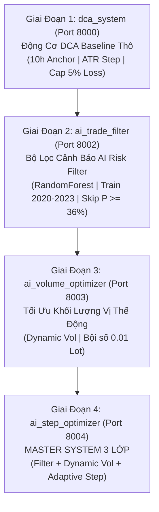

# SYSTEM ROCKET 2H - KIẾN TRÚC & QUY TRÌNH DỰNG HỆ THỐNG GIAO DỊCH TỰ ĐỘNG XAUUSD (DCA INTRADAY + AI RISK FILTER + DYNAMIC POSITION SIZING)

Hệ thống giao dịch thuật toán **System Rocket 2H** thiết kế riêng cho thị trường Vàng (XAUUSD), hoạt động trong khung thời gian vàng **10:00 sáng - 12:00 trưa ICT** (vỏn vẹn 2 tiếng/ngày).

Tài liệu này tổng hợp toàn bộ **Lộ trình Phát triển 4 Giai đoạn (Roadmap)** từ chiến lược thô ban đầu cho đến Hệ thống Master System phối hợp 3 Lớp AI tối thượng.

---

## 🗺️ LỘ TRÌNH PHÁT TRIỂN HỆ THỐNG (SYSTEM ROADMAP)



---

## 📂 CHI TIẾT TỪNG GIAI ĐOẠN DỰNG HỆ THỐNG

### 1️⃣ GIAI ĐOẠN 1: `dca_system/` (Hệ Thống DCA Baseline Gốc)
- **Cổng Web UI**: **`Port 8000`**
- **Thư mục**: [`dca_system/`](file:///Users/duongdv/Documents/Workspace/Personal/system_rocket2h/dca_system)
- **Nhiệm vụ & Logic Cốt Lõi**:
  - Xây dựng động cơ mô phỏng chiến lược nhồi lệnh DCA phiên trưa.
  - Lấy giá mở cửa lúc **10:00 sáng ICT** làm Giá Mốc Anchor Price ($P_0$).
  - Khoảng cách nhồi lệnh (Step Size) = **$1.0 \times \text{ATR14}$ nến M5** tính lúc 10h.
  - Chốt lời (Take Profit): Đồng loạt kéo về **Giá Mốc 10h00 ($P_0$)**.
  - Đóng lệnh bắt buộc (Time Cutoff): Đúng **12:00 trưa ICT** đóng sạch toàn bộ vị thế.
  - Quy tắc Quản trị Rủi ro Cấu trúc: **Daily Max Loss Cap = 5.0% (-$500 USD trên vốn $10,000 USD)**.
- **Lệnh thực thi**:
  ```bash
  cd dca_system
  docker compose up --build
  ```

---

### 2️⃣ GIAI ĐOẠN 2: `ai_trade_filter/` (Bộ Lọc AI Risk Filter)
- **Cổng Web UI**: **`Port 8002`**
- **Thư mục**: [`ai_trade_filter/`](file:///Users/duongdv/Documents/Workspace/Personal/system_rocket2h/ai_trade_filter)
- **Nhiệm vụ & Logic Cốt Lõi**:
  - Huấn luyện mô hình Học Máy `RandomForestClassifier` trên dữ liệu 4 năm (2020 - 2023) dựa trên 6 chỉ số nến sáng 10h (Scale-Invariant Features + Directional Intensity).
  - Dự báo xác suất rủi ro $P(\text{Risk})$ ngày giao dịch.
  - Nếu $P(\text{Risk}) \ge 36\%$ $\rightarrow$ Ép phát lệnh **`SKIP` (Không giao dịch ngày đó)**.
  - **Kết quả đạt được**: Chặn đứng các ngày bão rủi ro lớn nhất, bảo vệ 99.7% số ngày thắng TP, đưa Lợi Nhuận Ròng 2023-2024 **đảo chiều từ Âm -$2,028 USD vọt lên DƯƠNG +$733 USD (+7.34%)**.
- **Lệnh thực thi**:
  ```bash
  cd ai_trade_filter
  docker compose run --rm --build ai_train   # Step 2.1: Train AI
  docker compose up ai_web --build             # Step 2.2: Test & Web UI (8002)
  ```

---

### 3️⃣ GIAI ĐOẠN 3: `ai_volume_optimizer/` (Tối Ưu Khối Lượng Vị Thế Động)
- **Cổng Web UI**: **`Port 8003`**
- **Thư mục**: [`ai_volume_optimizer/`](file:///Users/duongdv/Documents/Workspace/Personal/system_rocket2h/ai_volume_optimizer)
- **Nhiệm vụ & Logic Cốt Lõi**:
  - Mở rộng thêm lớp quản trị khối lượng vị thế thông minh (**Dynamic Position Sizing**).
  - Căn cứ vào xác suất rủi ro $P(\text{Risk})$ lúc 10h sáng để gán khối lượng Lot size cho ngày đó (luôn là **bội số chuẩn của `0.01 Lot`**):
    - Ngày rủi ro cao ($P \ge 36\%$): `0.00 Lot` (`SKIP`).
    - Ngày rủi ro vừa ($20\% \le P < 36\%$): Tự động giảm Vol mượt xuống `0.03`, `0.04`, `0.05`, `0.07 Lot`.
    - Ngày an toàn cao ($P < 20\%$): Giữ nguyên `0.10 Lot`.
  - **Kết quả đạt được**: Số ngày dính Cắt Lỗ 5% giảm xuống kỷ lục chỉ còn **DUY NHẤT 1 NGÀY** trong cả 2 năm (2023-2024).
- **Lệnh thực thi**:
  ```bash
  cd ai_volume_optimizer
  docker compose run --rm --build volume_train # Step 3.1: Train AI Vol
  docker compose up volume_web --build           # Step 3.2: Test & Web UI (8003)
  ```

---

### 4️⃣ GIAI ĐOẠN 4: `ai_step_optimizer/` (MASTER SYSTEM 3 LỚP KẾT HỢP TỐI THƯỢNG)
- **Cổng Web UI**: **`Port 8004`**
- **Thư mục**: [`ai_step_optimizer/`](file:///Users/duongdv/Documents/Workspace/Personal/system_rocket2h/ai_step_optimizer)
- **Nhiệm vụ & Logic Cốt Lõi**:
  - Phối hợp **HOÀN HẢO CẢ 3 LỚP CHIẾN LƯỢC**:
    - **Lớp 1**: AI Risk Filter + Hard Loss Cap 5% (-$500 USD).
    - **Lớp 2**: AI Dynamic Volume Scaling ($V_{day} \in [0.00, 0.10]\text{ Lot}$).
    - **Lớp 3**: Adaptive Step Size Optimization ($\text{Step}_{day} = \alpha \times \text{ATR}$).
  - **Chế độ TẤN CÔNG (Ngày An Toàn $P < 20\%$)**:
    - Khối lượng: `0.10 Lot`.
    - Step Size: Thu hẹp **$\alpha = 0.50 \times \text{ATR}$ ($\approx 1.0$ giá Vàng)**.
    - $\Rightarrow$ Dễ dàng khớp 3-5 lệnh DCA trong 2 tiếng trưa, đẩy lợi nhuận chốt lời TP tăng bứt phá lên **+$40 đến +$70 USD / ngày thắng**.
  - **Chế độ PHÒNG THỦ (Ngày An Toàn Vừa $20\% \le P < 36\%$)**:
    - Khối lượng: Hạ xuống `0.04 - 0.06 Lot`.
    - Step Size: Giữ thưa an toàn **$\alpha = 0.85 \times \text{ATR}$ ($\approx 1.8$ giá Vàng)**.
    - $\Rightarrow$ Chặn đứng sụt giảm vốn Max Drawdown.
- **Lệnh thực thi**:
  ```bash
  cd ai_step_optimizer
  docker compose run --rm --build master_train # Step 4.1: Train Master AI
  docker compose up master_web --build           # Step 4.2: Test & Web UI (8004)
  ```

---

## 📊 BẢNG TỔNG HỢP CÁC CỔNG WEB UI DASHBOARD

| CỔNG PORT | THƯ MỤC THỰC THI | TÊN THÀNH PHẦN HỆ THỐNG | MỤC TIÊU & CHỨC NĂNG |
| :---: | :--- | :--- | :--- |
| **8000** | `dca_system/` | DCA Baseline Dashboard | Xem kết quả mô phỏng DCA thô chưa qua bộ lọc AI. |
| **8002** | `ai_trade_filter/` | AI Risk Filter Dashboard | Xem báo cáo AI lọc ngày bão và đối soát với Baseline. |
| **8003** | `ai_volume_optimizer/` | Dynamic Volume Dashboard | Xem phân bổ khối lượng Lot size (bội 0.01 Lot) từng ngày. |
| **8004** | `ai_step_optimizer/` | Master System Dashboard | Xem hiệu năng tổng thể phối hợp 3 Lớp (Filter + Vol + Step). |

---

## 🛠️ YÊU CẦU MÔI TRƯỜNG (REQUIREMENTS)
- Python `>= 3.11`
- Docker & Docker Compose
- Các thư viện cốt lõi: `pandas`, `numpy`, `scikit-learn`, `joblib`, `pytz`
